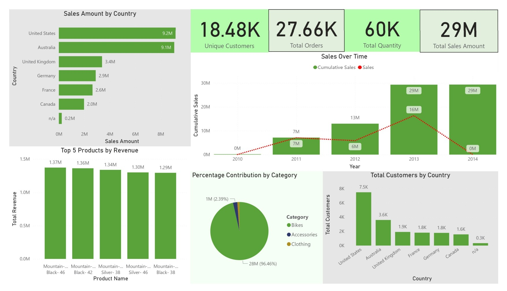

## Power BI Dashboard 

### Dashboard Features:
- **Executive Summary**: Key performance indicators (KPIs) including total revenue, orders, quantity and customers
- **Sales Trends**: Time series analysis showing yearly sales patterns
- **Geographic Analysis**: Revenue and customer distribution across different countries
- **Product Performance**: Category-wise analysis and top 5 performing products

The dashboard connects directly to the Gold Layer tables (Star/Snowflake schema) reporting and analysis.

